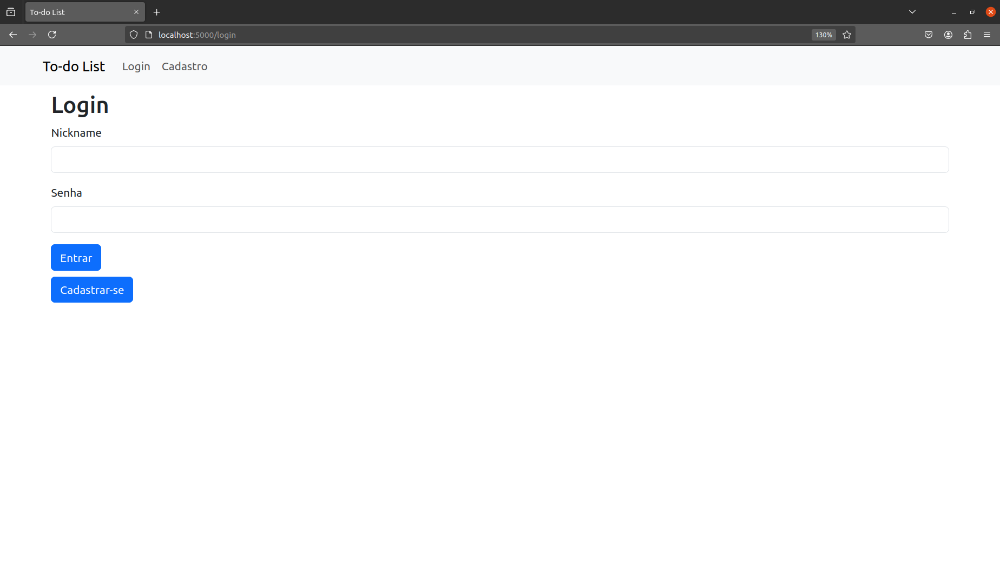
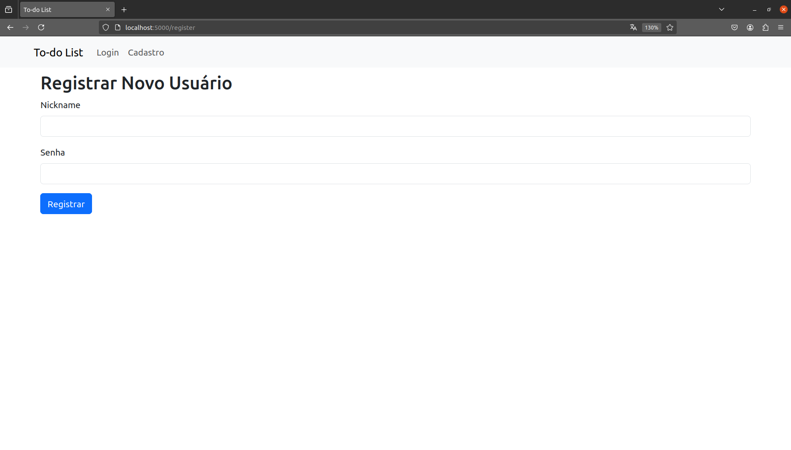
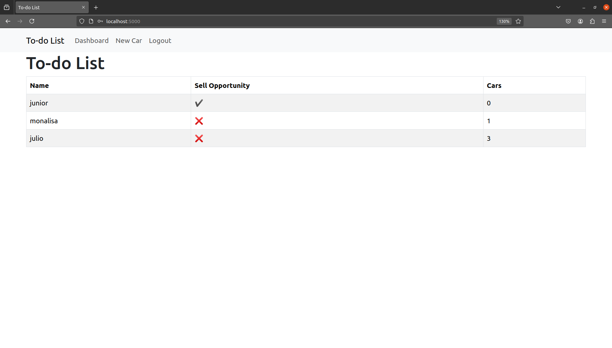
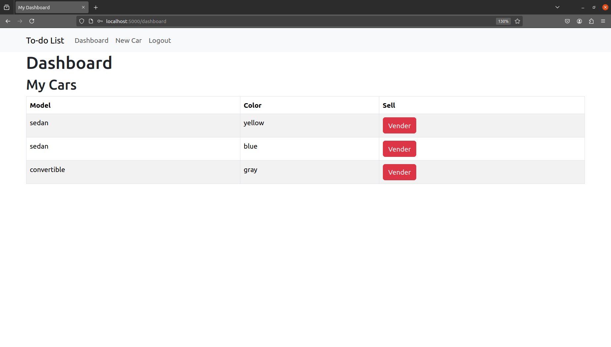
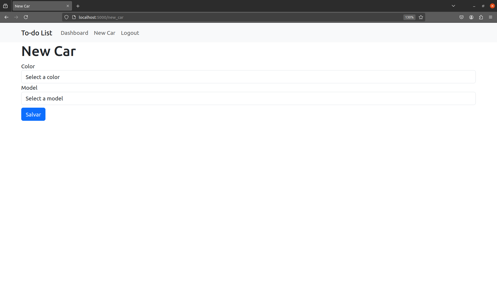

# Desafio Técnico Backend
Repositório relacionado ao Desafio Técnico Backend da AdviceHeath


# pythonToDoList

## Desenvolvimento de um Microserviço de To-Do List

- **Desafio Técnico**: Desenvolvimento de um Microserviço de To-Do List
- **Empresa**: AdviceHealth
- **Vaga**: Desenvolvedor Back End Python Pleno
- **Nome**: Júlio César Almeida Soares

---

## Descrição

Nork-Town é um lugar peculiar. Corvos grasnam nas manhãs enevoadas enquanto homens mais velhos apertam os olhos. É uma cidade pequena, e o prefeito teve uma ideia incomum: limitar o número de carros que uma pessoa pode possuir. Uma pessoa pode ter até 3 veículos. Cada veículo, registrado em nome de um proprietário, pode ter apenas uma das três cores: ‘yellow’, ‘blue’ ou ‘gray’. Os modelos dos carros são limitados a três tipos: ‘hatch’, ‘sedan’ ou ‘convertible’.

A concessionária Carford precisa de um sistema para gerenciar os proprietários de carros e seus veículos. Os proprietários podem ainda não possuir carros, mas devem ser marcados como oportunidades de venda. Os veículos não podem existir no sistema sem estarem vinculados a um proprietário.

---

## Linguagens e Tecnologias Utilizadas

- **Python**
- **Banco de Dados**: MySQL
- **IDE**: VSCode
- **Bibliotecas Python**: Flask, SQLAlchemy
- **Docker**: Para facilitar a implantação e execução do ambiente

---

## Instruções para Rodar o Projeto

### Guia de Instalação

1. Clone o repositório:
   ```bash
   git clone https://github.com/JulioSoaresA/teste_tecnico_advice_heath.git
2. Acesse o diretório do projeto:
   ```bash
   cd todo_list

### Instalação de Ambiente Virtual
  1. Baixe este repositório e entre no diretório do projeto.
  2. Crie um ambiente virtual utilizando o VirtualEnv:
     ```bash
     python -m venv venv
  3. Ativando o ambiente virtual:
     - No Linux:
       ```bash
       source venv/bin/activate

      - No Windows:
        ```bash
        .\venv\Scripts\activate.ps1
  4. Instale as dependências:
     ```bash
     pip install -r requirements.txt
     ```

  ### Instruções para Rodar o Projeto com Docker
  Basta executar:
  ```bash
  docker-compose up --build
  ```
  Isso irá construir e iniciar o container, incluindo o banco de dados e o servidor Flask.

  ---
### Rodando testes
```bash
docker-compose exec app pytest
```

## Estrutura do projeto
```bash
├── app.py
├── docker-compose.yml
├── Dockerfile
├── LICENSE
├── migrations
│   ├── alembic.ini
│   ├── env.py
│   ├── README
│   └── script.py.mako
├── README.md
├── requirements.txt
├── templates
│   ├── base.html
│   ├── dashboard.html
│   ├── index.html
│   ├── login.html
│   ├── new_car.html
│   └── register.html
└── test_app.py
```

---
### Funcionalidades

### 1. Tela de Login


### 2. Tela de Cadastro de Usuário


### 3. Tela Inicial (Index)


### 4. Tela de Dashboard


### 5. Tela de Cadastrar Carro



---

## Observações
Este projeto foi desenvolvido como parte de um desafio técnico, com foco em:
  - Práticas de desenvolvimento de Microserviços
  - Uso de Flask para criação de APIs
  - Implementação de operações CRUD (Create, Read, Update, Delete)
